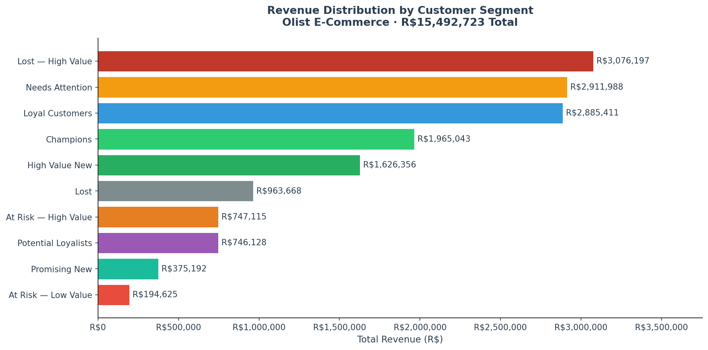
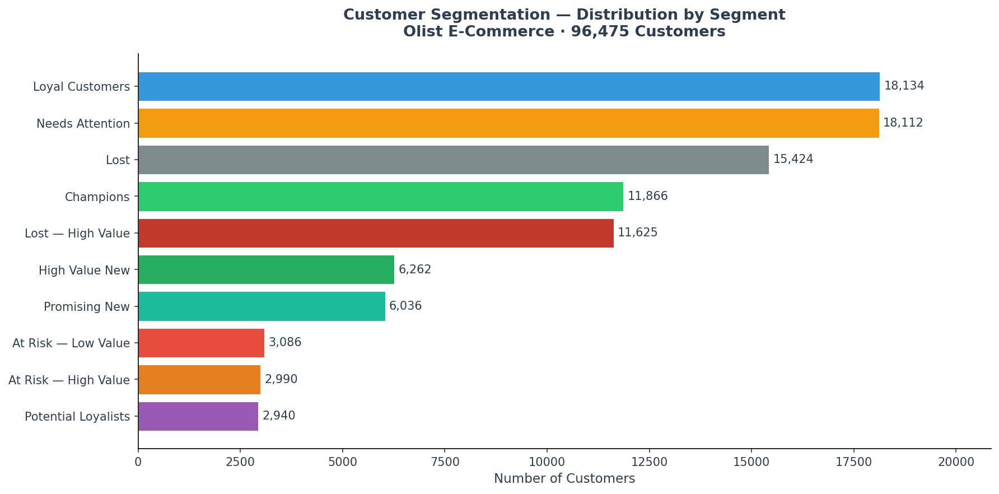
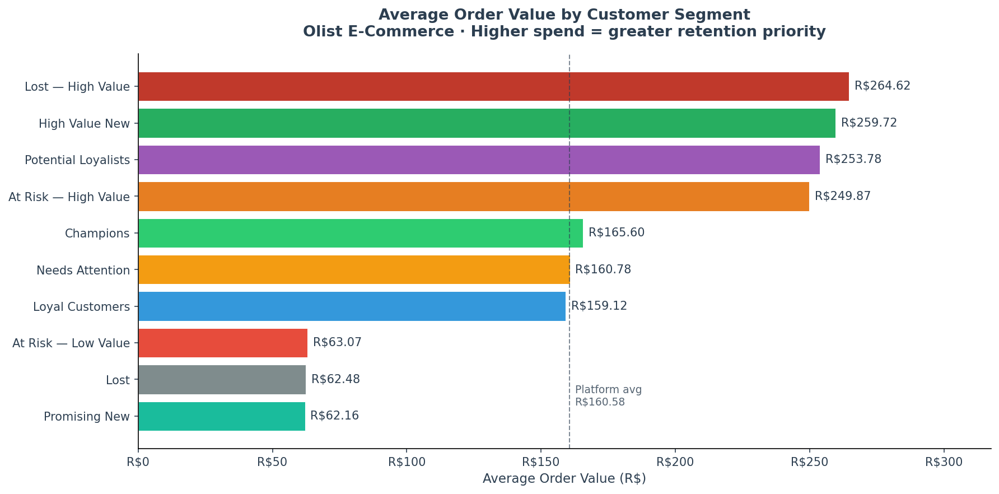
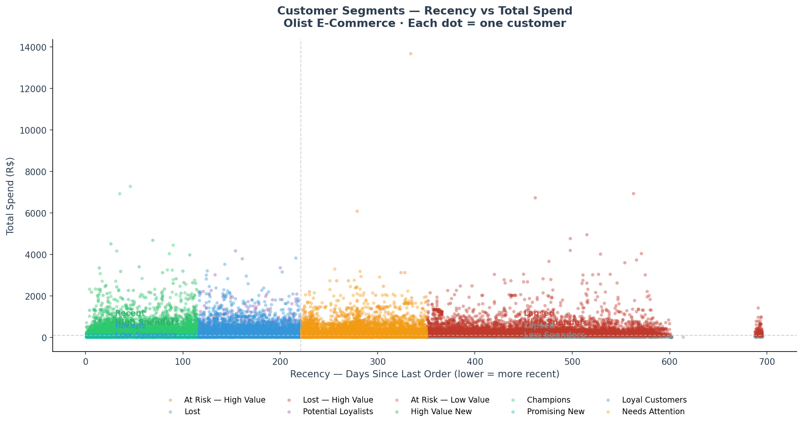

<div align="center">

# Olist E-Commerce — Customer Segmentation
## RFM Analysis & Behavioural Segmentation
### Data Analytics Project

**Analyst: Nothabo Michelle Moyo**
**Tool: Python · Jupyter Notebook**
**Dataset: 96,475 customers · R$15,491,723 total revenue**

[](olist_customer_segmentation.ipynb)
[](olist_customer_segmentation.ipynb)
[](data/final_cleaned_dataset.csv)

</div>

---

## Project Overview

This project segments 96,475 Olist Brazilian e-commerce customers into 10 distinct behavioural groups using **RFM Analysis**, a proven customer analytics framework used by marketing and commercial teams worldwide.

The analysis answers one central business question:

> *"Who are our customers, what are they worth, and what should we do about each group?"*

This project is the second part of a two-project Olist analysis series:
- **Project 1:** [Olist Funnel Performance Analysis — SQL & Tableau](https://github.com/Nothabo15/olist-ecommerce-analysis) — *What happened in the marketplace?*
- **Project 2 (this project):** Customer Segmentation — Python — *Who are the customers and which ones matter most?*

---

## What is RFM Analysis?

RFM stands for **Recency, Frequency, and Monetary value**, three dimensions that together describe a customer's relationship with a business:

| Dimension | Question | High Score Means |
|---|---|---|
| **Recency (R)** | How recently did they order? | Ordered very recently |
| **Frequency (F)** | How many times did they order? | Orders multiple times |
| **Monetary (M)** | How much have they spent in total? | High lifetime value |

Each customer receives a score of 1–4 on each dimension. The combined score (e.g. 441, 112) determines which of 10 behavioural segments they belong to.

---

## Key Findings

### Segment Overview

| Segment | Customers | Share | Total Revenue | Revenue Share | Avg Order Value |
|---|---|---|---|---|---|
| Lost — High Value | 11,625 | 12.1% | R$3,076,197 | 19.9% | R$264.62 |
| Needs Attention | 18,112 | 18.8% | R$2,911,988 | 18.8% | R$160.78 |
| Loyal Customers | 18,134 | 18.8% | R$2,885,411 | 18.6% | R$159.12 |
| Champions | 11,866 | 12.3% | R$1,965,043 | 12.7% | R$165.60 |
| High Value New | 6,262 | 6.5% | R$1,626,356 | 10.5% | R$259.72 |
| Lost | 15,424 | 16.0% | R$963,668 | 6.2% | R$62.48 |
| At Risk — High Value | 2,990 | 3.1% | R$747,115 | 4.8% | R$249.87 |
| Potential Loyalists | 2,940 | 3.0% | R$746,128 | 4.8% | R$253.78 |
| Promising New | 6,036 | 6.3% | R$375,192 | 2.4% | R$62.16 |
| At Risk — Low Value | 3,086 | 3.2% | R$194,625 | 1.3% | R$63.07 |

---

### Finding 1 — Lost High Value customers are the single largest revenue segment

**R$3,076,197, 19.9% of all platform revenue, belongs to customers who have left.**

These 11,625 customers spent an average of R$264.62 per order, the highest average order value of any segment, yet they have not returned. They are not low-value customers who drifted away. They are the platform's best customers, now shopping elsewhere.

This is the most urgent commercial finding in the analysis. A win-back campaign targeting even 20% of this segment would recover over R$600,000 in revenue.



---

### Finding 2 — 32% of customers are at risk of churning

The combined **Needs Attention**, **At Risk — High Value**, and **At Risk — Low Value** segments account for:
- **24,188 customers** (25.1% of the customer base)
- **R$3,853,728 in combined revenue** (24.9% of total)

These customers are still in the data, they have not fully lapsed, but their recency scores indicate declining engagement. This is the retention window. Once they cross into Lost territory, re-engagement becomes significantly more expensive.



---

### Finding 3 — High value customers are not the most numerous

Champions (12.3% of customers) and High Value New (6.5%) together represent fewer than 1 in 5 customers, yet generate **R$3,591,399, 23.2% of total revenue**. These segments punch well above their weight and warrant priority treatment in retention strategy.

The average order value chart makes the premium clear:



---

### Finding 4 — 94% of customers ordered only once

Nearly all customers across every segment have a Frequency score of 1. This is a structural characteristic of Brazilian e-commerce, the marketplace model attracts one-time purchasers rather than repeat buyers.

This single finding defines the platform's biggest growth opportunity. **Repeat purchase rate is the lever.** Converting even a fraction of one-time buyers into two-time buyers would materially shift revenue without any new customer acquisition cost.

---

### Finding 5 — The marketplace has two distinct customer tiers

The RFM scatter plot maps every customer by recency and total spend simultaneously, revealing the full customer lifecycle in one view:



- **Left cluster (green/blue)**, recent customers, still engaged, varying spend levels
- **Centre band (orange)**, customers drifting toward inactivity
- **Right mass (dark red)**, Lost High Value customers, 400–600 days inactive
- **Far right cluster**, earliest 2016 customers, completely lapsed

The visual separation between active and lapsed segments confirms that churn on this platform is not gradual, customers tend to either stay engaged or disappear entirely.

---

## Business Recommendations

| Priority | Segment | Recommendation | Expected Outcome |
|---|---|---|---|
| Critical | Lost — High Value | Launch a targeted win-back campaign, personalised discount or exclusive offer for 11,625 high-spend lapsed customers | Recovery of R$600K+ at 20% re-engagement rate |
| Critical | Needs Attention | Immediate re-engagement, time-sensitive offer before these customers cross into Lost territory | Protect R$2.9M in at-risk revenue |
| High | Champions | Loyalty programme, reward frequent high-value customers with early access, exclusive deals, or referral incentives | Increase frequency; reduce churn risk in best segment |
| High | High Value New | Onboarding sequence, targeted follow-up after first purchase to drive a second order within 30 days | Convert high-spend new customers into Loyal Customers |
| High | At Risk — High Value | Priority retention outreach, 2,990 customers averaging R$249.87 per order showing declining recency | Prevent R$747K from moving to Lost — High Value |
| Medium | Potential Loyalists | Nurture campaign, these customers show signs of loyalty but need encouragement to increase frequency | Build the next cohort of Loyal Customers |
| Medium | Promising New | Low-cost engagement, welcome series, product recommendations, review requests | Convert low-spend new buyers into repeat customers |
| Low | Lost — Low Value | Minimal investment, broad reactivation email only; do not prioritise over high-value segments | Marginal recovery at low cost |

---

## Technical Approach

### Libraries Used

```python
import pandas as pd          # Data manipulation and aggregation
import matplotlib.pyplot as plt  # Chart creation
import seaborn as sns        # Statistical visualisation
from datetime import datetime    # Date handling
```

### RFM Scoring Method

```python
# Recency: lower days = better = higher score
rfm['R_Score'] = pd.qcut(rfm['Recency'], q=4, labels=[4, 3, 2, 1])

# Frequency: higher count = better = higher score
rfm['F_Score'] = pd.qcut(rfm['Frequency'].rank(method='first'), 
                          q=4, labels=[1, 2, 3, 4])

# Monetary: higher spend = better = higher score
rfm['M_Score'] = pd.qcut(rfm['Monetary'], q=4, labels=[1, 2, 3, 4])

# Combined score
rfm['RFM_Score'] = (rfm['R_Score'].astype(str) +
                    rfm['F_Score'].astype(str) +
                    rfm['M_Score'].astype(str))
```

### Segmentation Logic

Customers were assigned to segments based on their R, F, and M score combinations:

| Segment | RFM Profile |
|---|---|
| Champions | R=4, F≥3 — recent and frequent |
| High Value New | R=4, F<3, M≥3 — recent, high spend, low frequency |
| Promising New | R=4, F<3, M<3 — recent but low spend |
| Loyal Customers | R=3, F≥2 — moderately recent and repeat buyers |
| Potential Loyalists | R=3, F<2, M≥3 — moderate recency, high spend |
| Needs Attention | R=2, F≥2 — declining recency but repeat buyers |
| At Risk — High Value | R=2, F<2, M≥3 — drifting, high spend |
| At Risk — Low Value | R=2, F<2, M<3 — drifting, low spend |
| Lost — High Value | R=1, M≥3 — lapsed, high historical spend |
| Lost | R=1, M<3 — lapsed, low historical spend |

---

## Skills Demonstrated

| Category | Detail |
|---|---|
| **Python** | pandas, matplotlib, seaborn, datetime, lambda functions, groupby aggregations |
| **Data Preparation** | Filtering, null handling, datetime conversion, reference date calculation |
| **RFM Methodology** | Quartile scoring with `pd.qcut()`, rank-based frequency scoring, composite score construction |
| **Customer Analytics** | Behavioural segmentation, lifetime value analysis, churn identification, retention strategy |
| **Data Visualisation** | Horizontal bar charts, scatter plots, custom colour palettes, reference lines, annotations |
| **Business Communication** | Segment-level recommendations, revenue exposure quantification, executive summary writing |

---

## Project Files

| File | Description |
|---|---|
| `olist_customer_segmentation.ipynb` | Full analysis notebook — data prep, RFM scoring, segmentation, visualisations |
| `charts/chart1_customer_segments.png` | Customer count by segment |
| `charts/chart2_revenue_segments.png` | Revenue distribution by segment |
| `charts/chart3_avg_order_value.png` | Average order value by segment |
| `charts/chart4_rfm_scatter.png` | RFM scatter — recency vs total spend |
| `data/final_cleaned_dataset.csv` | Cleaned Olist dataset — 104,477 rows, 22 columns |

---

## About the Analyst

I am a data analyst with a **Master's degree in Accounting** and a **Google Data Analytics Certificate (Coursera)**, actively transitioning into a full-time data analytics role.

This project is part of a two-project Olist series demonstrating end-to-end analytical capability — SQL cleaning and funnel analysis in Project 1, and Python-based customer segmentation in Project 2.

---

<div align="center">

**[GitHub Portfolio](https://github.com/Nothabo15)** · **[LinkedIn](https://www.linkedin.com/in/nothabo-michelle-moyo-a38840378/)** · **[Olist Funnel Analysis — Project 1](https://github.com/Nothabo15/olist-ecommerce-analysis)**

*Dataset: Olist Brazilian E-Commerce Public Dataset (Kaggle)*
*Analysis: Python · Jupyter Notebook*

</div>
